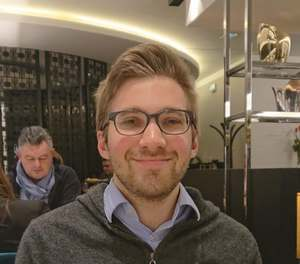
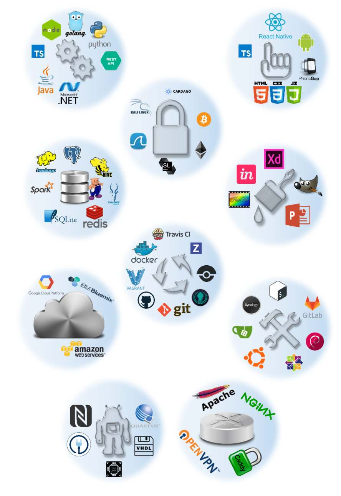
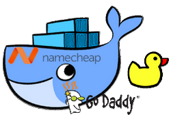
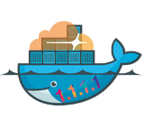
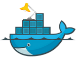
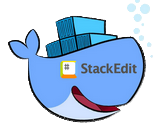
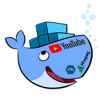
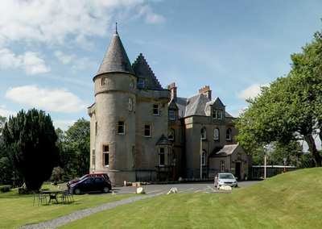

# Quentin McGaw

**Tags**: FullStackDev, CS MSc, EEE MEng, Go, Nodejs, React, Cloud, Crypto

## Introduction

- Working at [SweetIQ](https://sweetiq.com) as a full stack developer in downtown Montreal, Canada
- Author of [multiple 500K+ downloads open source projects](https://hub.docker.com/r/qmcgaw)
- Graduated from my [**Master** of **Computer science** at New York University](https://cs.nyu.edu/home/master/prospective_mscs.html) in May 2018 with 3.358 GPA
- Graduated from my [**Master** of **Electrical and electronic engineering with management** from Imperial College London](https://www.imperial.ac.uk/study/ug/courses/electrical-engineering-department/electrical-and-electronic-engineering-management/)
  in June 2016 with upper second class honours
- Fluent in English and French
- Maurtian and Luxembourgish, and lived:
    - 2019- Montreal
    - 2018-2019 Luxembourg and Romania
    - 2016-2018 New York City
    - 2012-2016 London
    - 2006-2012 Nice, France
    - 2005-2006 Villars-sur-Ollons, Switzerland
    - 1995-2006 Luxembourg

## Links

- [My updated **resume**](https://docs.google.com/document/d/1gW0IHPsngqwVWQA4ERTgOxG5V7-DIBQmt1SBq5LQEzI/export?format=pdf)
- [Github](https://github.com/qdm12)
- [Docker Hub](https://hub.docker.com/r/qmcgaw)
- [**https://qqq.ninja**](https://qqq.ninja)
- [Medium](https://medium.com/@quentin.mcgaw)
- [LinkedIn](https://linkedin.com/in/quentin-mcgaw-72981165)
- [Sololearn profile](https://www.sololearn.com/Profile/7022047)

## Expertise - Full stack dev and more

My favourites are Go, NodeJS, Docker, React.JS, Typescript, PostgreSQL, Redis, networking and cryptography/security

I also master several other languages such as Java, Python, C++ although I do not use them in my daily life.

The following represents icons of software or technology I am skilled in.

You can check a list of my skills in detail at [the bottom](#skills-details)

## Work experience

### SweetIQ, 2019

- Software developer
- Go programming mostly
    - Event driven architecture
    - Unit and integration tests writing
    - Final state machine development

### Mobile app development, 2018-2019

- Consists in a scalable mobile app
- Involves the following technologies
    - Golang and high performance web scrapping
    - Docker, Docker-Compose
    - PostgreSQL, Redis
    - ReactJS, React Native with Typescript
    - Puppeteer nodejs server (HTMLSpitter)
    - Google Places API and Geocoding

### Hospital catering mangement system, nov-dec 2018

- Google App Engine based, written in Typescript
- Supports 3 hospitals and a total of 8 floors simultaneously

### Multiple websites

- [Law office website](https://grozinger-partners.com)
- Initial development of [idonly.com](https://idonly.com) frontend
- [Culinart restaurant](https://restaurantculinart.com)
- [My website](https://qqq.ninja)

### Internship at Coinplus, 2015

- 6 months in a Bitcoin startup in Luxembourg
    - Regulated and secured storage of bitcoins
    - Regulated transactions of bitcoins
- My role as a software engineer was to develop a security solution for the storage of Bitcoin private keys
    - Cryptography (PKI, RSA, ECDSA, secret sharing...)
    - Bitcoin protocol
    - Python programming
    - Networking, RabbitMQ
- The final outcome was the patenting of my solution under the company's name.

### Summer internship at STMicroelectronics, 2014

- 3 months at STMicroelectronics in Sophia Antipolis, France.
    - In the NFC mobile application development team of 15 persons.
    - The company was developing a new NFC chip for Android smartphones.
- My role was to add support for the detection of multiple NFC cards simultaneously by an Android smartphone with their chip
    - Android OS modifications in C, C++ and Java
    - Android app development to showcase the OS modifications made
    - Understanding of the Android OS and of all the NFC technologies to date
    - Use of CyanogenMod on a Nexus devices for testing during development

***

### Personal projects

- [Go Dev container](https://github.com/qdm12/godevcontainer) to develop in a container with VS code
- [Updated](https://github.com/qdm12/updated) written in Go, to periodically generate malicious lists of IPs and hostnames
- [DDNS Updater written in Go](https://github.com/qdm12/ddns-updater), **450K+** pulls

    

- [HTMLSpitter](https://github.com/qdm12/htmlspitter) to scrap the web with Puppeteer
- [Welcome written in Go](https://github.com/qdm12/welcome) to automate SSH login tasks
- [Simple QR code generator](https://github.com/qdm12/qr) written in Go
- Many Docker images
    - [DNS over TLS](https://github.com/qdm12/cloudflare-dns-server), **500K+** pulls

        

    - [Private Internet Access VPN](https://github.com/qdm12/private-internet-access-docker), **500K+** pulls

        

    - [Teamspeak server](https://github.com/qdm12/teamspeak-server-alpine), 93K downloads
    - [Port checker written in Go](https://github.com/qdm12/port-checker)
    - [Meemo server](https://github.com/qdm12/meemo), 63K pulls

        

    - [Stackedit server](https://github.com/qdm12/stackedit-docker), 11K pulls

        

    - [Minecraft Spigot Server](https://github.com/qdm12/spigot-docker)

        

    - [Youtube-dl Alpine container](https://github.com/qdm12/youtube-dl-docker)

        

    - [Rsync](https://github.com/qdm12/rsync-docker)
    - [Omada controller](https://github.com/qdm12/omada)
    - [Caddy proxy on Scratch](https://github.com/qdm12/caddy-scratch)
    - [Call of duty server](https://github.com/qdm12/cod4-docker)
    - [Docker Hub trigger](https://github.com/qdm12/dockerhub-trigger)

- Open source contributions
    - [Mermaid Live Editor](https://github.com/mermaidjs/mermaid-live-editor/pull/63)
    - [Lazydocker](https://github.com/jesseduffield/lazydocker/pull/36)
    - [Plex media server](https://github.com/spritsail/plex-media-server/pull/6)

- Design of Redio

    [Redio gif](gifs/redio.gif)

- [AdsUp](https://sites.google.com/view/adsup/home)
- Design of simple desktop web pages using Adobe XD for a travelling website (for a Psychological study)
    - [Male version](https://xd.adobe.com/view/844b6668-0d5c-4d92-b30f-6bcbf3ce8479/?fullscreen)
    - [Female version](https://xd.adobe.com/view/192c9261-da69-48d6-81ac-570b5e4f5e16/?fullscreen)
- [My computing course](https://github.com/qdm12/My-Computing-course) (unfinished)
- [ThumbGifs](https://github.com/qdm12/ThumbGifs) (which is used for this document actually)

***

## Hobbies

### Homelab

- Main server - Arch Linux - Ryzen 2600X - 2x12TB + 2xSSD all in encrypted ZFS
    - [DNS over TLS server](https://github.com/qdm12/cloudflare-dns-server), self-made
    - [DDNS Updater](https://github.com/qdm12/ddns-updater), self-made
    - [Caddy](https://github.com/qdm12/caddy-scratch) on Scratch, partly self-made
    - [Gitea](https://github.com/go-gitea/gitea)
    - [PIA VPN client](https://github.com/qdm12/private-internet-access-docker), self-made
    - [Plex Media Server](https://github.com/spritsail/plex-media-server), contributed
    - [Youtube-dl](https://github.com/qdm12/youtube-dl-docker), partly self-made
    - [Syncthing](https://hub.docker.com/r/linuxserver/syncthing)
    - [Deluge](https://hub.docker.com/r/linuxserver/deluge)
    - [COD4x Dedicated server](https://github.com/qdm12/cod4-docker), partly self-made
    - [Minecraft Spigot server](https://github.com/qdm12/spigot-docker), partly self-made
    - [DockerHub trigger](https://github.com/qdm12/dockerhub-trigger), self-made
    - [Docker proxy](https://github.com/qdm12/docker-proxy-acl-alpine), self-made
    - [Drone CI](https://hub.docker.com/r/drone/drone)
    - [Droppy](https://hub.docker.com/r/silverwind/droppy)
    - [Iperf](https://hub.docker.com/r/networkstatic/iperf3)
    - [Meemo](https://github.com/qdm12/meemo), partly self-made
    - [Netdata](https://hub.docker.com/r/netdata/netdata)
    - [Rsync](https://github.com/qdm12/rsync-docker), self-made
    - [Samba](https://hub.docker.com/r/dperson/samba)
    - [SFTP](https://hub.docker.com/r/atmoz/sftp)
    - [Wireguard](https://wireguard.com)
    - [Updated](https://github.com/qdm12/updated), self-made
    - [Wekan](https://quay.io/wekan/wekan)
- Secondary server - Alpine Linux - Ryzen 2600 - 120GB SSD in encrypted ZFS
    - Running Caddy, Rsync, Samba, Wireguard, DNS over TLS server and DDNS updater
- Synology DS918+ - 4x4TB NAS in BTRFS with all services using Docker
- [Raspberry Pi 3B](https://github.com/qdm12/RaspberryPi)
- GliNet AR300 for *airports* essentially
- [Assembling desktops and servers](#computer-builds)

### Social

- [Reddit](https://www.reddit.com/user/dowitex)
- [Medium](https://medium.com/@quentin.mcgaw)
- [Quora](https://www.quora.com/profile/Quentin-McGaw)

### Other

- Cycling, gym, skiing, running
- Cryptocurrencies, [Ebay](http://feedback.ebay.ie/ws/eBayISAPI.dll?ViewFeedback2&userid=dowi9876&ftab=FeedbackAsSeller), Audiobooks
- Games: PlanetSide 2, Minecraft, Call of Duty 4

***

## Education

## New York University, September 2016 to May 2018

### Courses

- [Cloud computing](https://github.com/qdm12/courses/tree/master/Cloud-computing)
    - AWS with CloudFoundry & Bosh
    - Ongoing project
- [.NET Web development](https://github.com/qdm12/courses/tree/master/.NET-Web-development)
- [Cryptocurrency and decentralized ledgers](https://github.com/qdm12/courses/tree/master/Cryptocurrency-and-decentralized-ledgers)
    - **Bitcoin** protocol: mining, transactions, cryptography etc.
    - **Ethereum**: Solidity-written smart contracts
- [Real time big data analytics](https://github.com/qdm12/courses/tree/master/Real-time-big-data-analytics)
    - Hadoop with NYU's Dumbo clusters in *Java* and *Python*
    - Hive, Impala, Spark, Pig etc.
    - [**Bitcoin Use Trends**](https://github.com/qdm12/BitcoinUses) project

    

- [Design and Development: Web and mobile apps](https://github.com/qdm12/courses/tree/master/Design-and-development-of-mobile-and-web-apps)
    - [**Bill Splitter** project](https://github.com/qdm12/BillSplitter)

    

- [Technology, design and entrepreneurship](https://github.com/qdm12/courses/tree/master/Technology-and-entrepreneurship)
    - Ended up with the *Mealracle* project I am still working on (March 2019)
- DevOps
    - [Project](https://qdm12.github.io/Devops_RESTful)
    - Advanced Git, Zenhub and GitKraken
    - Vagrant and Docker on IBM Bluemix cloud
    - Python with Flask and a Redis database
    - Travis CI, unit testing and behave
    - RESTful API with Swagger
    - Web security
- [Database Systems](https://github.com/qdm12/courses/tree/master/Database-systems)
    - Microsoft Visio (ER diagram, Crow's feet notation etc.)
    - SQL databases
    - Normalization, minimum cover, etc.
- Mobile online social gaming
    - Chess game project [**here**](https://github.com/qdm12/Chess_2016)
    - Typescript, HTML, CSS
    - Jenkins and code coverage
    - Artificial intelligence
    - PhoneGap and monetizing the app

    

- Operating System
    - C++ assignments: scheduler, linker, IO, memory management
    - Processes, threads, scheduling, concurrency, memory management, IO, file systems, Networking, cloud and distributed computing
- [Programming languages](https://github.com/qdm12/courses/tree/master/Programming-languages)
    - Scala, Java, ML, Scheme, Ada
    - Syntax, scoping, call stack, recursion, lambda calculus, dynamic storage
- [Fundamental algorithms](https://github.com/qdm12/courses/tree/master/Fundamental-Algorithms)
    - Data structures: Heap, binary search trees, Hash tables, 
    - Sort algorithms: Quicksort, Countingsort, Radixsort, Bucketsort, Mergesort
    - Dynammic programming: LCS, Parenthesizations, Matrix-chain-product
    - Optimization: Activity selector, Rod cutting problem
    - Graphs: BFS, DFS, Top-sort, Minimum Spanning tree, Kruskal, Prim, Dijkstra
    - Others: Huffman coding, P/N/NP, Arithmetic (Euclid, PKI etc.)

***

## Imperial College London, October 2012 to June 2016

### Master's thesis

- [**hbc**](https://qdm12.github.io/hbc/) for Homomorphic binary circuits
- My aim was to develop easy to use digital circuits using fully homomorphic encryption.
    - Understanding of the [HElib library](https://github.com/shaih/HElib)
    - Programming in C++
    - Cryptography and security
- Homomorphic encryption allows to perform analytics on encrypted data, which will be very useful for cloud computing.
- Report available [here](docs/Homomorphic-encryption-Cryptography-for-cloud-computing-report.pdf)
- Click on the following animation to play the video

### Final year, 2015-2016

#### Courses

- Network and web security
    - Javascript, HTML, SQL
    - Cryptography
- Coding Theory
    - Cryptography
    - Communication theory
    - [30 minutes course I gave to fellow students](docs/Presentation-coding-theory-Bitcoin.pptx)
- High performance computing for engineers
    - Amazon web services (AWS)
    - C++, OpenCL and TBB (intel)
    - Complex Makefiles
    - Understanding of GPUs architecture
- Mobile healthcare and machine learning
    - [**Android app**](https://github.com/qdm12/Staminapp) development with Android Wear
    - [**Machine learning**](https://github.com/qdm12/Staminaputations) in Python (clustering)
    - NodeJS, SQL database
    - Report available [here](docs/Stamina-report.pdf)
    - Click on the following animation to play the video
        - 
- Managing innovation
- Managerial economics
    - Full syllabus [here](managerial_economics.md)
    - 
- Corporate finance
    - Group [report on the fair valuation of the S&P500](docs/Fair-Valuation-of-the-SP500-index.pdf)
    - Group [presentation on the MSFT Valuation](docs/Microsoft-Corp-(MSFT)-Valuation.pdf)
    - Full syllabus [here](corporate_finance.md)
    - 

### Third year, 2014-2015

#### Courses

- Digital signal processing
- Advanced signal processing
    - Use of Matlab
    - [Coursework report](docs/Advanced-signal-processing-report.pdf)
- Artificial intelligence
    - Use of Prologue
- Communication networks
- Real-time digital signal processing
    - Based on C and C++ projects to filter signals
    - [Report on Interrup I/O laboratory](docs/RTDSP-report-3.pdf)
    - [Report on Real time implementation of FIR filters laboratory](docs/RTDSP-report-4.pdf)
    - [Report on Real time implementation of IIR filters laboratory](docs/RTDSP-report-5.pdf)
    - [Report on a speech enhancement project](docs/RTDSP-report-project.pdf)
- Entrepreneurship
    - [Business plan](docs/Business-plan-Sports-Connect.pdf) about Sports Connect
- Accounting
- Project management
    - Group project on the Boeing 747 project

### Second year, 2013-2014

#### Courses

- Algorithms and data structures
    - C, C++
    - Binary trees and so on
- Introduction to computer architecture
    - Use of ARM7 assembly language for some assignments
- Semiconductor devices
- Algorithms and complexity
    - *O* notation
    - divide-and-conquer and so on
- Mathematics
- Digital electronics
    - Programming FPGAs using *Verilog* in pairs
    - MPLabs assembler
    - 
- Analogue electronics
- Power engineering
- Communication systems
- Signal and linear systems
- Control engineering

#### Year group project: *Wasteless*

- Leader of a team of 7 students
- Goal was to develop an ecosystem to reduce the waste of expired food
    - Push notification to the smartphone of the user about food products nearly expired
    - Propose the user to share nearly expired food with neighbours
    - Establish a network of "food friends" with reputation points, messaging and so on
- This involved several technologies and developments
    - At the supermarket level, barcodes were replaced by low-cost RFID chips 
      (contactless) containing the expiry date of the product in addition to 
      the barcode data. This also allowed a faster checkout for the customer.
    - At the customer level, an Android application was developed
    - A C++ based server was developed to communicate information on all the goods bought by each user and to handle the food social network.
    - A C++ client program for the cashier at the supermarket was developed.
    - A website was also designed for non-mobile users of Wasteless.
- The final state of the group project was actually promising and we obtained surprisingly high marks

### First year, 2012-2013

#### Courses

- Software engineering: C & C++
- Mathematics
- Professional engineering
    - [Report on Micro NAND flask memory chips](docs/Professional-report-Micron-20nm-MLC-NAND-flash-128Gb-memory-chip.pdf)
- Analysis of circuits
    - Use of Cadsoft Eagle and PSPice
- Digital electronics
    - Altera Quartus 12
    - 
- Semiconductor devices
- Analogue electronics
- Energy conversion
- Signals and communication

#### Year group project: *EEBug*

- Leader of a team of 6 students
- Goal was to build a toy following a black line on the floor for GBP 5.00
- It involved
    - PSPice to design the circuits
    - Project and team management (reports, charts, deadlines...)
    - Hardware testing (opAmps, Resistances etc.)
- 

### Graduation results

I have obtained my Master's degree with upper second class honours and 61.32% overall
You can check out the certificate [here](docs/Degree-imperial-college-london.pdf)

***

## French scientific baccalaureate, 2012

### Courses

- Mathematics with specialty in arithmetics
- Physics and chemistry
- Biology and geology
- History and geography
- Philosophy
- Latin, English, Spanish, French
- Sports

### Articles published in a french Hardware Magazine (2008, 13 years old)

***

## Skills details

Legend: **Advanced skills**, Intermediate skills, *Beginner skills*

### Backend

- **Golang**
- **Node.JS & Typescript** ([Sololearn certification](https://www.sololearn.com/Certificate/1024-7022047/pdf/?mode=download))
- **Python**
- **Scalable & distributed systems**
- C++
- Java ([Sololearn certificate](https://www.sololearn.com/Certificate/1068-7022047/pdf/?mode=download))
- .NET C#
- *Ethereum Solidity*
- *OpenCL and CUDA*
- **REST, unit testing**

### Database

- **Postgresql** ([Sololearn certificate](https://www.sololearn.com/Certificate/1060-7022047/pdf/?mode=download))
- **Redis**
- **SQLite**
- MySQL
- Hadoop
- *Hive*
- *Impala*
- *Spark*

### Frontend

- **React.JS & Typescript**
- **React Native & Typescript**
- **HTML, CSS, Js**
- **Jquery** ([Sololearn certificate](https://www.sololearn.com/Certificate/1082-7022047/pdf/?mode=download))
- Phonegap

### Design

- **Adobe XD**
- *Invision*
- **Gimp**
- **Photofiltre**

### Security

- **Cryptography**
- **Network security**
- **Bitcoin protocol**
- Ethereum protocol

### Server admin

- **SSH+Mosh**
- **Many various shells**
- User & group management
- Reverse proxies **Caddy**/Nginx/*Apache*
- **Alpine Linux**, **Debian**, **DSM**, RancherOS, *CentOS*

### DevOps

- **Docker**
- Vagrant with Virtual Box
- **Git** with **Github**, **Gitea** and **GitKraken**
- **Zenhub, Wekan**
- Drone CI
- **Travis CI**

### Cloud

- **Google Cloud**
- AWS
- IBM Bluemix
- RancherOS
- Containers registries

### Algorithms

- **Cryptography**
- Fundamental algorithms
- Mathematics
- Control engineering

### Hardware

- FPGAs
- Digital electronics
- Digital signal processing
- Power engineering
- Analogue electronics
- NFC technology
- Android OS (C, C++ & Java)

### Managerial skills

- Corporate finance
- **Economics**
- UK Accounting
- **Project management**
- **Entrepreneurship**
- Innovation management

***

## Others

### Fun facts

- I have a driving license (from UK)
- I climbed the [Kilimanjaro](https://goo.gl/maps/Pur81wuxvzs) mountain in Tanzania at the age of 12

    
    

- I had a summer job as a waiter and cleaner in the [Castle Venlaw Hotel](https://goo.gl/maps/d6Waq2cGDsp) in Scotland, Peebles

    

- All my grades are accessible in this [**formatted spreadsheet**](https://docs.google.com/spreadsheets/d/1udRYqsP2acNWp2wQk6SEaNb65T-0Gl_vL5lXWiQSeGQ/edit?usp=sharing)
- I write some funny theories like this [**one**](docs/fun-theory.md)
- My first server: The Raspberrypi Pi (thanks Denisa)

    

### Computer builds

- October 2018 - now: Server Ryzen 2600, 16GB, 2xSSD on ZFS, GT740
- July 2018 - now: Ryzen 2700X, 16GB DDR4 3200MHz, GTX 1080

Type|Item
:----|:----
**Motherboard** | [Asus - ROG STRIX X470-I GAMING Mini ITX AM4 Motherboard](https://pcpartpicker.com/product/Z922FT/asus-strix-x470-i-gaming-mini-itx-am4-motherboard-strix-x470-i-gaming)
**CPU** | [AMD - Ryzen 7 2700X 3.7GHz 8-Core Processor](https://pcpartpicker.com/product/bddxFT/amd-ryzen-7-2700x-37ghz-8-core-processor-yd270xbgafbox)
**Video Card** | [Zotac - GeForce GTX 1080 8GB Mini Video Card](https://pcpartpicker.com/product/CdTrxr/zotac-geforce-gtx-1080-8gb-mini-video-card-zt-p10800h-10p)
**Memory** | [G.Skill - Ripjaws V Series 16GB (2 x 8GB) DDR4-3200 Memory](https://pcpartpicker.com/product/9rDzK8/gskill-memory-f43200c14d16gvr)
**CPU Cooler** | [Noctua - NH-L12 37.8 CFM CPU Cooler](https://pcpartpicker.com/product/PP4gXL/noctua-cpu-cooler-nhl12)
**Power Supply** | [Silverstone - 600W 80+ Gold Certified Fully-Modular SFX Power Supply](https://pcpartpicker.com/product/vQjG3C/silverstone-power-supply-sstsx600g)
**Case**| Ncase M1
**Storage** | [Samsung - 950 PRO 256GB M.2-2280 Solid State Drive](https://pcpartpicker.com/product/FdDzK8/samsung-internal-hard-drive-mzv5p256bw)
**Storage** | [Seagate - FireCuda 2TB 2.5" 5400RPM Hybrid Internal Hard Drive](https://pcpartpicker.com/product/zk7CmG/seagate-firecuda-2tb-25-5400rpm-internal-hard-drive-st2000lx001)
**Storage** | [Samsung - 840 Pro Series 128GB 2.5" Solid State Drive](https://pcpartpicker.com/product/LrNp99/samsung-internal-hard-drive-mz7pd128bw)
**Storage** | [Seagate - Momentus 5400.6 500GB 2.5" 5400RPM Internal Hard Drive](https://pcpartpicker.com/product/YtDwrH/seagate-internal-hard-drive-st9500325as)
**Fan hub**|  Phanteks PWM Fan Hub Controller
**Case Fan** | [Corsair - Air Series SP120 High Performance Edition (2-Pack) 62.7 CFM  120mm Fans](https://pcpartpicker.com/product/Jc8Zxr/corsair-case-fan-co9050008ww)
**Case Fan** | [ARCTIC - Arctic F12 74.0 CFM  120mm Fan](https://pcpartpicker.com/product/qCH323/arctic-cooling-case-fan-afaco12000gba01)
**Case Fan** | [ARCTIC - Arctic F9 43.0 CFM  92mm Fan](https://pcpartpicker.com/product/Qmw323/arctic-cooling-case-fan-afaco09000gba01)
**Thermal Compound** | [ARCTIC - MX-2 4g Thermal Paste](https://pcpartpicker.com/product/3wLypg/arctic-cooling-thermal-paste-mx2r)

- May 2017 - July 2018: i5 6500, 16GB DDR4 3000MHz, GTX 1080

Type|Item
:----|:----
**Motherboard** | [EVGA - Z270 Stinger Mini ITX LGA1151 Motherboard](https://pcpartpicker.com/product/P2Z2FT/evga-z270-stinger-mini-itx-lga1151-motherboard-111-ks-e272-kr)
**CPU** | [Intel - Core i5-6500 3.2GHz Quad-Core Processor](https://pcpartpicker.com/product/xwhj4D/intel-cpu-bx80662i56500)
**Video Card** | [Zotac - GeForce GTX 1080 8GB Mini Video Card](https://pcpartpicker.com/product/CdTrxr/zotac-geforce-gtx-1080-8gb-mini-video-card-zt-p10800h-10p)
**Memory** | [Corsair - Vengeance LED 16GB (2 x 8GB) DDR4-3000 Memory](https://pcpartpicker.com/product/WTM323/corsair-vengeance-led-16gb-2-x-8gb-ddr4-3000-memory-cmu16gx4m2c3000c15b)
**CPU Cooler** | [Noctua - NH-L12 37.8 CFM CPU Cooler](https://pcpartpicker.com/product/PP4gXL/noctua-cpu-cooler-nhl12)
**Power Supply** | [Silverstone - 600W 80+ Gold Certified Fully-Modular SFX Power Supply](https://pcpartpicker.com/product/vQjG3C/silverstone-power-supply-sstsx600g)
**Case**| Ncase M1
**Storage** | [Samsung - 950 PRO 256GB M.2-2280 Solid State Drive](https://pcpartpicker.com/product/FdDzK8/samsung-internal-hard-drive-mzv5p256bw)
**Storage** | [Seagate - FireCuda 2TB 2.5" 5400RPM Hybrid Internal Hard Drive](https://pcpartpicker.com/product/zk7CmG/seagate-firecuda-2tb-25-5400rpm-internal-hard-drive-st2000lx001)
**Storage** | [Samsung - 840 Pro Series 128GB 2.5" Solid State Drive](https://pcpartpicker.com/product/LrNp99/samsung-internal-hard-drive-mz7pd128bw)
**Storage** | [Kingston - SSDNow V300 Series 120GB 2.5" Solid State Drive](https://pcpartpicker.com/product/rtzv6h/kingston-internal-hard-drive-sv300s37a120g)
**Storage** | [Seagate - Momentus 5400.6 500GB 2.5" 5400RPM Internal Hard Drive](https://pcpartpicker.com/product/YtDwrH/seagate-internal-hard-drive-st9500325as)
**Fan hub**|  Phanteks PWM Fan Hub Controller
**Case Fan** | [Corsair - Air Series SP120 High Performance Edition (2-Pack) 62.7 CFM  120mm Fans](https://pcpartpicker.com/product/Jc8Zxr/corsair-case-fan-co9050008ww)
**Case Fan** | [ARCTIC - Arctic F12 74.0 CFM  120mm Fan](https://pcpartpicker.com/product/qCH323/arctic-cooling-case-fan-afaco12000gba01)
**Case Fan** | [ARCTIC - Arctic F9 43.0 CFM  92mm Fan](https://pcpartpicker.com/product/Qmw323/arctic-cooling-case-fan-afaco09000gba01)
**Thermal Compound** | [ARCTIC - MX-2 4g Thermal Paste](https://pcpartpicker.com/product/3wLypg/arctic-cooling-thermal-paste-mx2r)

- March 2016 - May 2017: i5 6500, 16GB DDR4 3000MHz, GTX 970

- 2014 - March 2016: i5 3570k, 8GB DDR3, GTX 580 SLI/GTX 770

- 2013 - 2014:  i5 3570k, 8GB DDR3, GTX 570/580

- 2012: i7 2600k, 6GB DDR3, HD 5830

- 2011-2012: i7 920, 3GB DDR3, HD 5830

- 2010-2011: i7 920, 3GB DDR3, HD 5830

- 2009-2010: i7 920, 3GB DDR3, HD 5830

- See more on [Google Drive](https://drive.google.com/drive/folders/0B5UPjZHikV5gQ3pyTVR2M3RMaUk?usp=sharing)